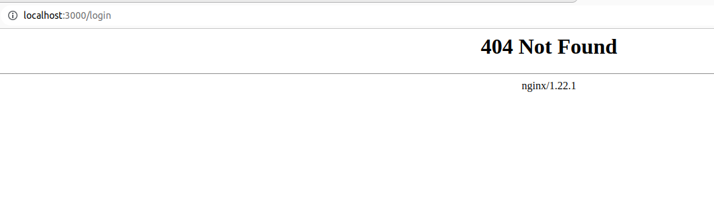

# Problema
Al crear la imagen de docker del frontend y ejecutarla entra perfectamente al login y redirecciona al register de manera correcta pero al momento de recargar da un error 404 tal como se muestra en la siguiente imagen:



# Solución
Esto se debe a que no se tiene una correcta configuracion de nginx ya que react como tal compila unicamente la pagina index pero no las demas como la de register, login, etc. Entonces se debe de crear un archivo con la [configuracion](https://github.com/LuisBarrera23/SO1_ACTIVIDADES_202010223/blob/main/Actividad3/frontend/nginx.conf) nginx para que siempre las solicitudes sean redirigidas correctamente. El Archivo se debe crear con el siguiente contenido: 

```conf
server {
  listen 80;
  server_name localhost;

  location / {
    root /usr/share/nginx/html;
    try_files $uri $uri/ /index.html;
    index index.html;
  }
}
```

En el archivo [DockerFile](https://github.com/LuisBarrera23/SO1_ACTIVIDADES_202010223/blob/main/Actividad3/frontend/nginx.Dockerfile) del nginx se debe agregar esta linea que su funcion es mover dentro del contenedor la nueva configuracion que se indico en el archivo nginx.conf: 

```Dockerfile
COPY nginx.conf /etc/nginx/conf.d/default.conf
```

EL Dokerfile completo quedaria de esta manera:

```Dockerfile
## BUILD
# docker build -t mifrontend:0.1.0-nginx-alpine -f nginx.Dockerfile .
## RUN
# docker run -d -p 3000:80 mifrontend:0.1.0-nginx-alpine
FROM node:18.14.0-buster-slim as compilacion

LABEL developer="jesus guzman" \
      email="susguzman@gmail.com"

ENV REACT_APP_BACKEND_BASE_URL=http://localhost:3800

# Copy app
COPY . /opt/app

WORKDIR /opt/app

# Npm install
RUN npm install

RUN npm run build

# Fase 2
FROM nginx:1.22.1-alpine as runner

COPY nginx.conf /etc/nginx/conf.d/default.conf
COPY --from=compilacion /opt/app/build /usr/share/nginx/html

```